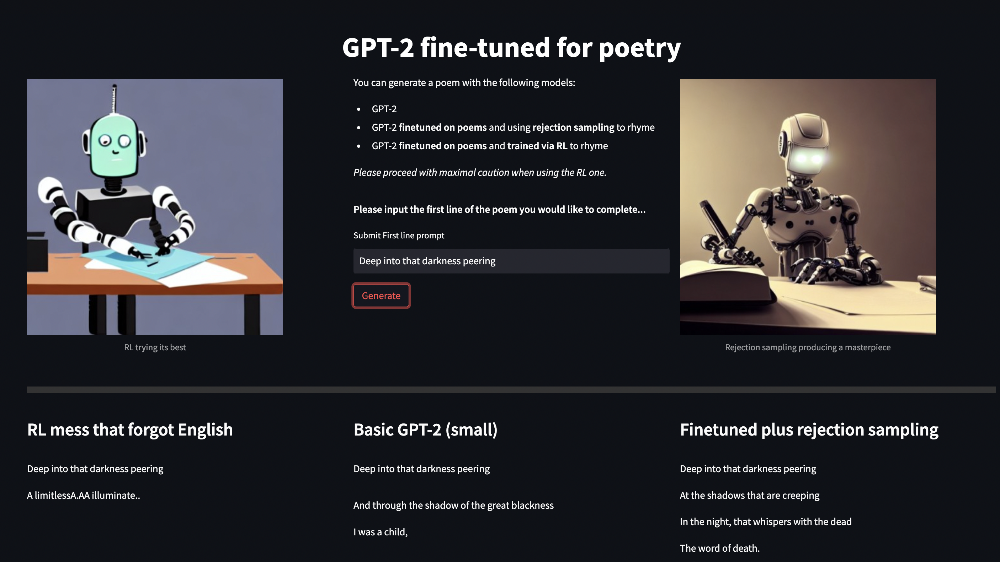

# Poetry generation with GPT-2 
## MLAB Summer 2022 Week 4 project by Erik Jenner and Alexandra Souly 

The main goal of our project was to fine-tune GPT-2 small to generate rhyming poetry, based on a starting line given by the user. We have tried a few different approaches: fine-tuning with self-supervised learning using a rhyming poems dataset, rejection sampling to force rhymes, and using RL with a reward function that encourages rhymes and a stanza format.

Full project report can be found at [Project report](MLAB_project_summary.pdf)

We have created a web interface for poem generation using Streamlit, which allows a user to generate a poem from a prompt using GPT-2, our self-supervised fine-tuned rejection sampling model, and our RL model. Only the second model produces real poetry, but the other two provide entertaining comparisons. 

To play around with the web interface, run:  
`pip install streamlit`  
`streamlit run streamlit_demo/run_demo.py`

and open the URL that shows up in the terminal in a web browser.

